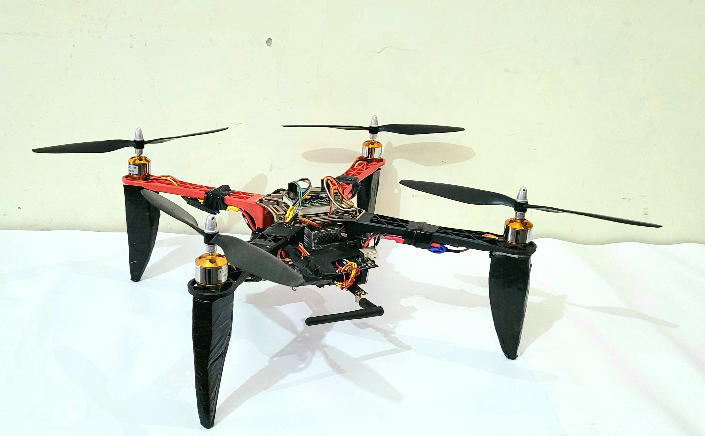
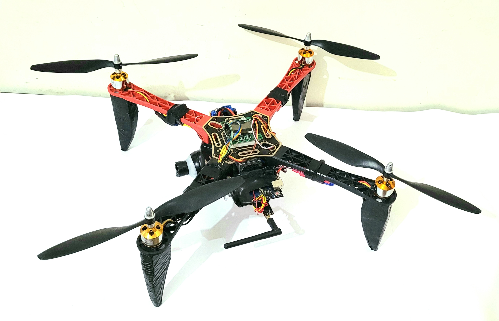
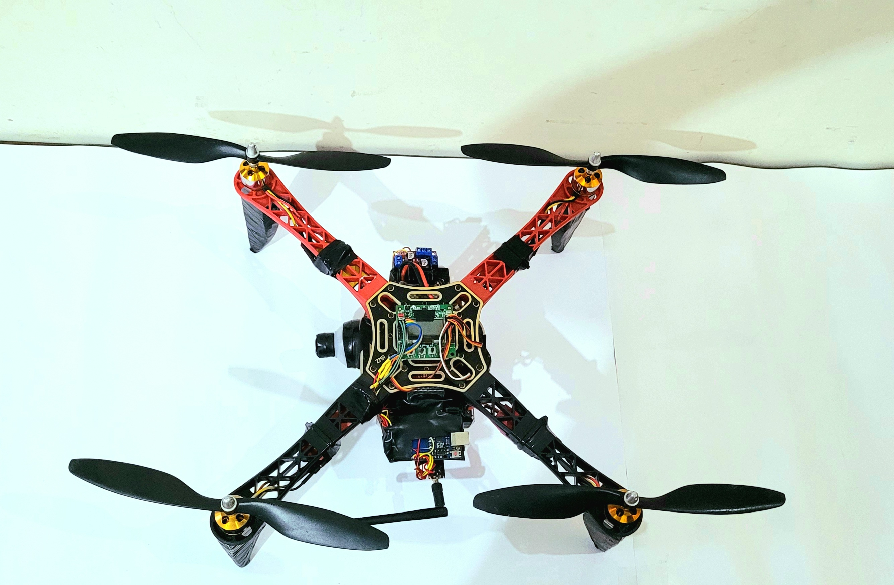

# Surveillance Drone for Detection and Control of Pest Infected Crop Patches
---
This project is aimed at providing smart remote solutions to farmers for the detection and control of pest-infected crop patches. A real-time video feed was created using Python programs to detect and recognize the pest-infected crops which were executed on Raspberry Pi.

## Components/Configurations
Flight Control Unit(FCU) - KK 2.1.5 \
Motors - BLDC 1400KV \
Battery - LiPo 2200mAh 11.1V 25C \
ESC - 30A \
Frame - Quad Arm \
Transmitter & Receiver - nRrf24L01 \
Balanced Charger - 3-Cell Charging \
Propeller - Twin Blade \
Raspberry Pi - Model No.4 4GB RAM \
Camera - 8Mp Raspberry Camera \
Mini Submersible Pump - 3-6V, 130-220mA \
Motor Driver - BMP 280 Sensor 

<h2>Image Gallery</h2>

 

 

